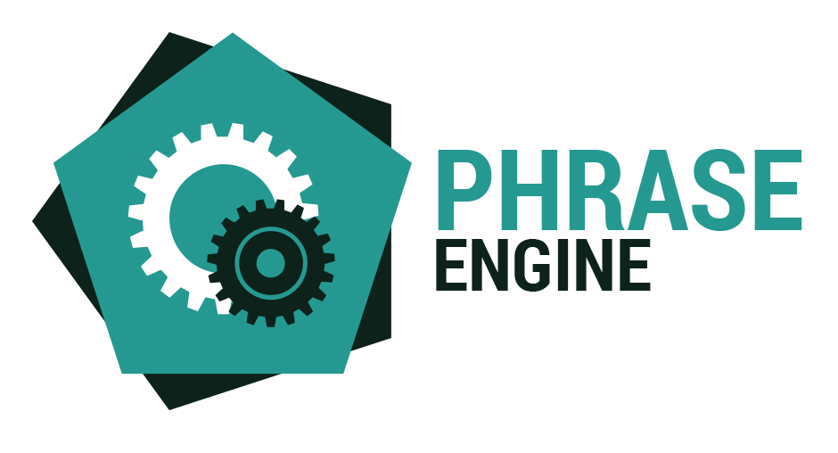

<link rel="stylesheet" href="https://cdnjs.cloudflare.com/ajax/libs/font-awesome/4.7.0/css/font-awesome.min.css">

<link rel="stylesheet" href="./bootstrap.min.css" />
<link rel="stylesheet" href="./styles/main.css" />
<section class="welcome">
    

        

            

                
            

            
&nbsp;

            

                
                    <strong>Language files</strong> on steroids
                    for <strong>UIs</strong> that aren’t boring.
                
            

        

        

            <a href="https://www.github.com/Hedronium/PhraseEngine" class="btn btn-normal">
                
                    <i class="fa fa-github"></i>
                
                Check Us Out.
            </a>
            <a href="./try.htm" class="btn btn-ghost">
                Try It
                In your browser. Right now.
            </a>
        

        

            

                Docs
                <i class="fa fa-arrow-down"></i>
            

        

    

</section>

